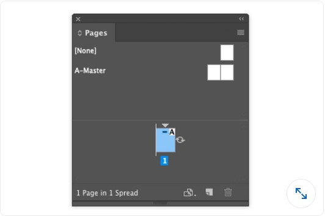
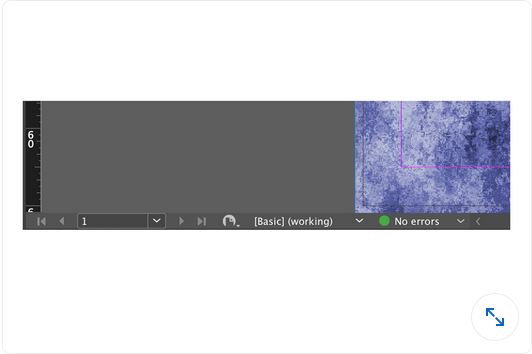

## Adobe InDesign

#### Q1. What is one reason to click Object > Text Frame Options?

- [ ] to change the number of columns in a text frame
- [ ] to apply a drop shadow to the frame
- [ ] to change the corners of a frame from corner to rounded
- [ ] to change the fill and stroke of a text frame

#### Q2. Which panel allows you to add an arrowhead to the end of a line?

- [ ] Effects
- [ ] Stroke
- [ ] Transform
- [ ] Pathfinder

#### Q3. In the image shown, what do you know about the Body Text paragraph style?

- [ ] The selected text was not formatted using the style definition.
- [ ] The selected text is in overset text outside the boundaries of the current frame.
- [ ] The style has been applied to two or more paragraphs.
- [ ] The style has been added since the master styles were created.

#### Q4. In the image shown, what does the icon to the right of the page thumbnail indicate?

- [ ] There are one or more items on this page that are rotated or flagged for rotation.
- [ ] The page appears rotated in the document window, but will print unrotated.
- [ ] The page is marked to be rotated when exported or printed.
- [ ] The page thumbnail in the Pages panel appears rotated.

#### Q5. You have used the Page Transitions panel to create transitions from one page to the next. Which feature in the Export to Interactive PDF dialog box lets you see the transitions in the PDF?

- [ ] Layout > Single Page
- [ ] View > Fit Page
- [ ] Create Tagged PDF
- [ ] Open in Full Screen Mode

#### Q6. You select a frame and click Object > Arrange > Send to Back. The frame still appears above another object on your page. What is the most likely reason?

- [ ] The two objects are on a master page.
- [ ] The objects are on two different pages on the spread.
- [ ] The objects are on two different layers.
- [ ] You did not choose the layer in the Layers panel first.

#### Q7. You want to move an image from one graphic frame to another. Which feature will you need to use?

- [ ] File > Adjust Layout
- [ ] Object > Arrange
- [ ] Edit > Paste Into
- [ ] Edit > Place and Link

#### Q8. What action can the Pen tool perform on a selected object?

- [ ] The Pen tool cannot affect an object after it has been created.
- [ ] You can click a point to convert it to a curve.
- [ ] You can drag the Pen tool inside a frame to convert it to a compound shape.
- [ ] You can click a point to delete it.

#### Q9. Which panel is best suited for converting 10 images into a single slideshow on a page?

- [ ] Effects
- [ ] Media
- [ ] Object States
- [ ] Transform

#### Q10. You have created a document with animations and other interactive elements. What is the best way to preview the document before exporting to Publish Online?

- [ ] EPUB Interactivity Preview panel
- [ ] View > Screen Mode > Presentation
- [ ] Media panel
- [ ] Separations Preview panel

#### Q11. You have placed an image in your InDesign document, but the quality seems low and the path edges appear pixelated. How do you determine if the image is good enough to include in the final document?

- [ ] Reimport the image, but use Show Import Options.
- [ ] Click View > Screen Mode.
- [ ] Click View > Display Performance.
- [ ] From the Links panel menu, select Embed Link.

#### Q12. What is one reason you might want to use the Text Variables feature?

- [ ] to create captions underneath images that update automatically
- [ ] to adjust text size automatically to fill the frame
- [ ] to include calculations inside a dynamic table
- [ ] to create running headers that include chapter names

#### Q13. In the image shown, what can you infer about the document?

- [ ] The image is incorrectly linked.
- [ ] Document and print presets are applied correctly.
- [ ] There are no images that are too low resolution.
- [ ] There are no text frames that have overset text.

#### Q14. You have a multipage InDesign document that you will export as a PDF file for on-screen viewing. You want to create bookmarks in the PDF file for all the paragraphs set to your "Heading 1" paragraph style. Which feature should you use?

- [ ] the Page Transitions panel
- [ ] Edit > Find/Change
- [ ] the Hyperlinks panel
- [ ] Layout > Table of Contents

#### Q15. Suppose that master page B is based on master page A, and you are currently editing master page B. Which statement is true?

- [ ] objects on master page A cannot be selected or changed.
- [ ] Objects on master page A are not visible.
- [ ] objects on master page A must always appear behind objects from master page B.
- [ ] Objects on master page A cannot be selected unless you override the objects.
